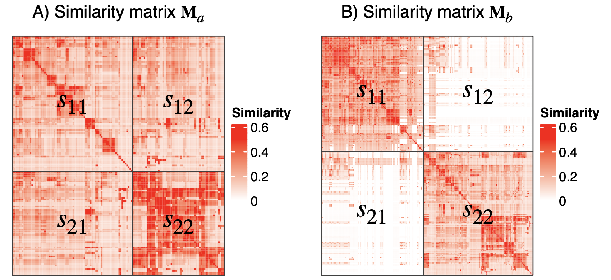

```{r, echo = FALSE}
library(knitr)
knitr::opts_chunk$set(
    error = FALSE,
    tidy  = FALSE,
    message = FALSE,
    warning = FALSE,
    fig.align = "center"
)
options(width = 100)
```

In binary cut algorithm, phase 1, step 1:

> For the similarity matrix $\mathbf{M}$ of a given gene set, apply a certain
> partitioning method (e.g., partitioning around medoids (PAM)) with two-group
> classification on both rows and columns, which partitions $\mathbf{M}$ into four
> submatrices, denoted as $\mathbf{M}_{11}$, $\mathbf{M}_{12}$, $\mathbf{M}_{21}$, and $\mathbf{M}_{22}$ where the indices represent the
> groups in the two matrix dimensions. Next calculate the following scores $s_{11}$,
> $s_{12}$, $s_{21}$ and $s_{22}$ for the four submatrices. Taking $s_{11}$ as an example, denote $X$
> as a vector of entries in $\mathbf{M}_{11}$, $s_{11}$ is calculated as $1-\int_0^1F_X(x)dx$
> where $F_X(x)$ is the cumulative distribution function (CDF) of $X$. Please note, when calculating $s_{11}$ and $s_{22}$, 
> entries on the diagonal of $\mathbf{M}_{11}$ and $\mathbf{M}_{22}$ are excluded. Since the similarity matrix 
> is always symmetric, $s_{12}$ and $s_{21}$ are equal. $s_{11}$ or $s_{22}$ is defined to be 1 if $\mathbf{M}_{11}$ or $\mathbf{M}_{22}$ have only one row. 
> We then define the score $s$ as $s=\frac{s_{11}+s_{22}}{s_{11}+s_{12}+s_{21}+s_{22}}$.

A demonstration of $s_{11}$, $s_{12}$, $s_{21}$ and $s_{22}$ is in the following figure:



The upper bound of $s$ is always 1, but the lower bound of $s$ is not exactly 0.5. In very rare cases, the lower bound of $s$ is smaller than 0.5, but still very close to 0.5.

First, we demonstrate it with 100 random GO datasets. Here two helper functions are used. `simplifyEnrichment:::cluster_mat()` applies binary cut and it returns a dendrogram object where score $s$ is stored on every node. Later `dend_node_apply()` is applied to extract $s$.

```{r}
library(simplifyEnrichment)
set.seed(123)
sl = list()
for(i in 1:100) {
    go_id = random_GO(500)
    mat = GO_similarity(go_id)
    d = simplifyEnrichment:::cluster_mat(mat)
    sl[[i]] = dend_node_apply(d, function(x) attr(x, "score"))
}
```

The scores are visualized by a boxplot and very few scores are less than 0.5:

```{r}
boxplot(sl)
abline(h = 0.5, col = "red", lty = 2)
```

We can quantitatively calculate the fraction of score $s$ smaller than 0.5:

```{r}
s_small = sapply(sl, function(x) sum(x < 0.5)/length(x))
s_small
hist(s_small)
mean(s_small)
```

In this random dataset, the probability for $s$ smaller than 0.5 is zero.

Second, we demonstrate it wit the Expression Atlas dataset. In the following code, `mat_list` contains a list of 468 matrices of GO similarities.

```{r}
mat_list = readRDS("GO_BP_sim.rds")
sl = list()
for(i in seq_along(mat_list)) {
    d = simplifyEnrichment:::cluster_mat(mat_list[[i]])
    sl[[i]] = dend_node_apply(d, function(x) attr(x, "score"))
}
```

Similarly, the probability for $s$ smaller than 0.5 can be calculated as:

```{r}
s_small = sapply(sl, function(x) sum(x < 0.5)/length(x))
hist(s_small)
mean(s_small)
```

The probability is also very tiny.
